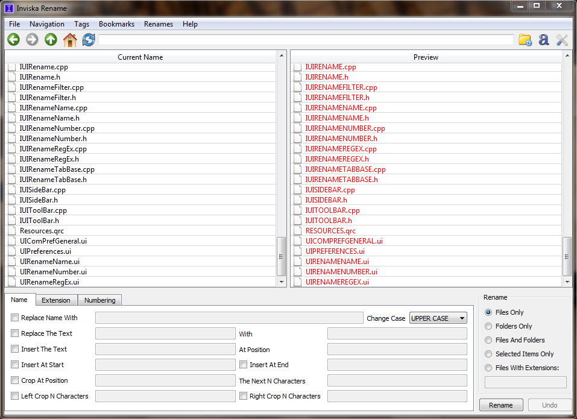

  

# About Inviska Rename

Inviska Rename is a batch file rename utility that allows you to give meaningful names to groups of files. It can be used for renaming music files from tags, renaming photos from Exif information, replacing photograph names like DSC04651.JPG with more useful names like "Spain Holiday - 154.jpg", and other renaming tasks.

# Features

Inviska Rename can perform the following operations:

* Insert, remove and replace text in filenames and extensions.
* Rename using music tags, including mp3 ID3v2 tags, FLAC tags, and other audio tags.
* Rename using Exif information from digital photographs.
* Rename using file creation or modification date.
* Rename using regular expressions.
* Automatically number files with option to adjust numbering order.
* Change filename to uppercase, lowercase, title case or sentence case.
* Filter items to be renamed based on extension, selection, files only or folders only.
* Save rename settings for later use.
* Undo previous rename operation to restore original filenames.
* Navigate through directories to locate the files you wish to rename.
* Bookmark directories for easy access.
* Show/hide hidden files to include/exclude them from rename operations.
* Easily see which files will be renamed with highlighting of modified filenames in the Preview pane.
* View tags present in file (Exif screenshot, Music screenshot) and edit music tags before renaming.
* Full Unicode support for all character sets.
* Cross platform, running on Windows 7+, macOS 10.12+ and Linux.
* Free open-source software released under the GPLv2+ licence.

# Screenshots

  

